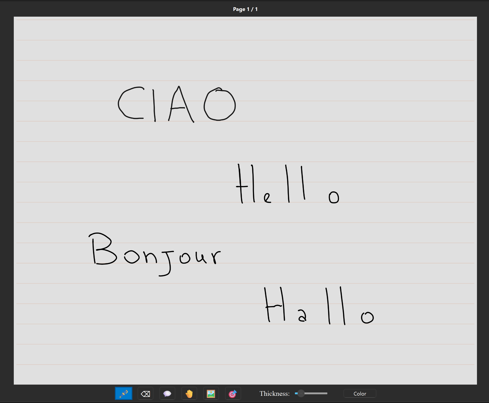

# Diary

A simple Diary application created because I don't want to give my data to other companies, and I need Surface Pen support.

Since I'm paranoid, I added encryption with XChaCha20-Poly1305, with key derivation using Argo2ID. The save system uses MsgPack with ZSTD compression.

The app is developed in Python, using the PyQt6 framework.

## Info

It is still very much in active development. I'm rewriting the rendering part, because the current one is able to lazy load in another process, which is great, but requires re-rendering for any change in the page, since the elements are drawn into a Pixmap.

## Getting started

- Clone the repository: `git clone https://github.com/DeeJack/diary`
- Create virtual environment: `python -m venv .venv`
- Activate the venv: `source .venv/bin/activate` (Linux), `.\\.venv\\Scripts\\activate` (Windows)
- Install the package: `pip install .`
- Run: `python -m diary.main`

## TODO

[ ] Generate executable
[ ] Rewrite rendering process
[ ] Allow selection/move/resizing
